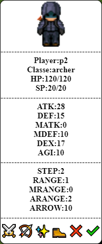

# Personagens

# Movimentação de curto alcance (Personagens de magia)

# Ataque de médio alcance (Personagens de magia)

# Dano magico é alto

# Movimentação de médio alcance (Personagens de dano fisico)

# Ataque de curto alcance (Personagens de dano fisico)

# Dano fisico é médio

# Ajustes
Healer deve poder curar a si mesma

# Problemas do bot
Ataques de flecha não são concluidos quando o personagem está ao lado do inimigo
Negromante não usa magia ainda
Necromante não prioriza ataque fisico de longo alcance
O bot não prioriza ataques de flecha o mais longe possível do alvo
O bot não prioriza ataques magicos o mais longe possível do alvo
Ao click na tela antes do bot terminar seu turno ele acaba travando
